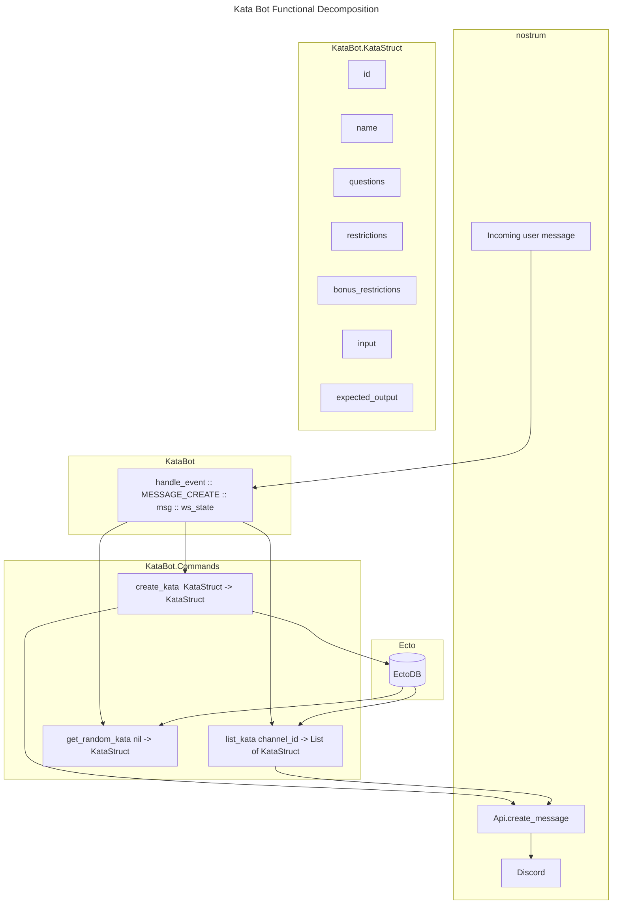

# Community Projects

# Kata Discord Bot

## Resources

- [Github Repo]()
- [Project Board](https://github.com/orgs/elixirlearners/projects/1)

## Idea overview

A discord bot that posts a daily "Kata". These should be short programming problems
that can be solved in <1 hour. They could be Elixir specific, but I think it might
be more useful for them to be "general" story problems that require you to implement
some kind of basic programming algorithm then you CAN use Elixir to solve it but other
languages would work too. I think making them general and not specific may make this
bot useful for more than just this discord. Of course, the actual bot will be written
in Elixir. The problems should be in the format of;

- Story Question
- Restrictions
- Optional Bonus Restrictions
- Input (This can be plain text or a link to a text file)
- Expected Output (Hidden with a spoiler or something)
- Here would be an example;

Problem

Being the good person you are, you decided help your local library digitize a bunch
of old books, magazines, ect. for archiving purposes. They've collected all sorts of
texts and apparently someone thought it would be useful to archive a bunch of old
phone books. Luck you, they already scanned them all and ran them through a
image-to-text AI that generated a text file containing the data! Unlucky for
you, it jumbled up the ordering so all the phone numbers got mixed up. Could
you be a pal and sort them?

Restrictions

You cannot use any external or built in sorting functions.

Bonus

Write one with quick sort and one with bubble sort. Which one is faster?

Input

`[333-333-3333, 111-111-1111, 222-222-2222]`

Expected

>![111-111-1111, 222-222-2222, 333-333-3333]

## Functional Decomposition

