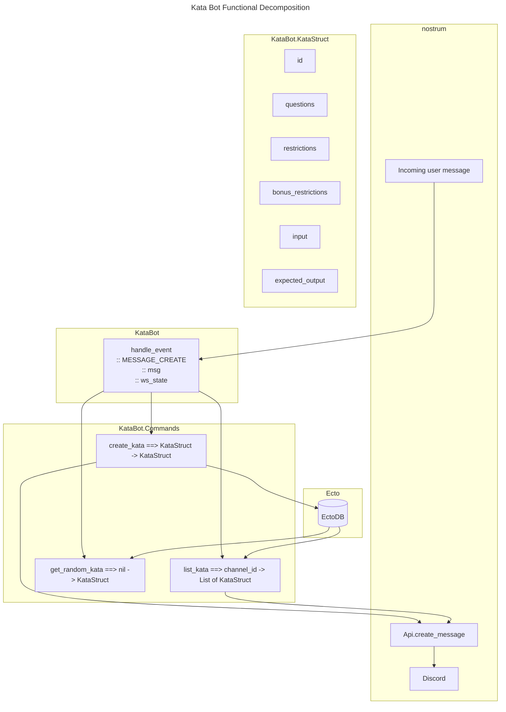

# Functional Decompisiton

[Link to Livebook rendered version](https://calebg-livebook.fly.dev/apps/kata-bot-decomp/s5hvql2g7f5lxewvoqpaao4g5dsyefei7htokxtrrms2xnsn)

```mermaid
---
title: Kata Bot Functional Decomposition
---
flowchart TD

    subgraph nostrum
      Api.create_message
      Api.create_message --> Discord
      user_msg[Incoming user message]
    end 

    subgraph KataBot
      user_msg --> handle_event[
          handle_event
          :: MESSAGE_CREATE
          :: msg
          :: ws_state
      ]
    end

    subgraph KataBot.KataStruct
        id
        questions
        restrictions
        bonus_restrictions
        input
        expected_output
    end

    subgraph KataBot.Commands
      handle_event --> create_kata[
          create_kata ==> KataStruct -> KataStruct
      ]
      create_kata --> Api.create_message
      handle_event --> list_kata[
          list_kata ==> channel_id -> List of KataStruct
      ]
      list_kata --> Api.create_message
      handle_event --> get_random[
        get_random_kata ==> nil -> KataStruct
      ]
    end

    subgraph Ecto
      create_kata --> EctoDB[(EctoDB)]
      EctoDB --> list_kata
      EctoDB --> get_random
    end
```